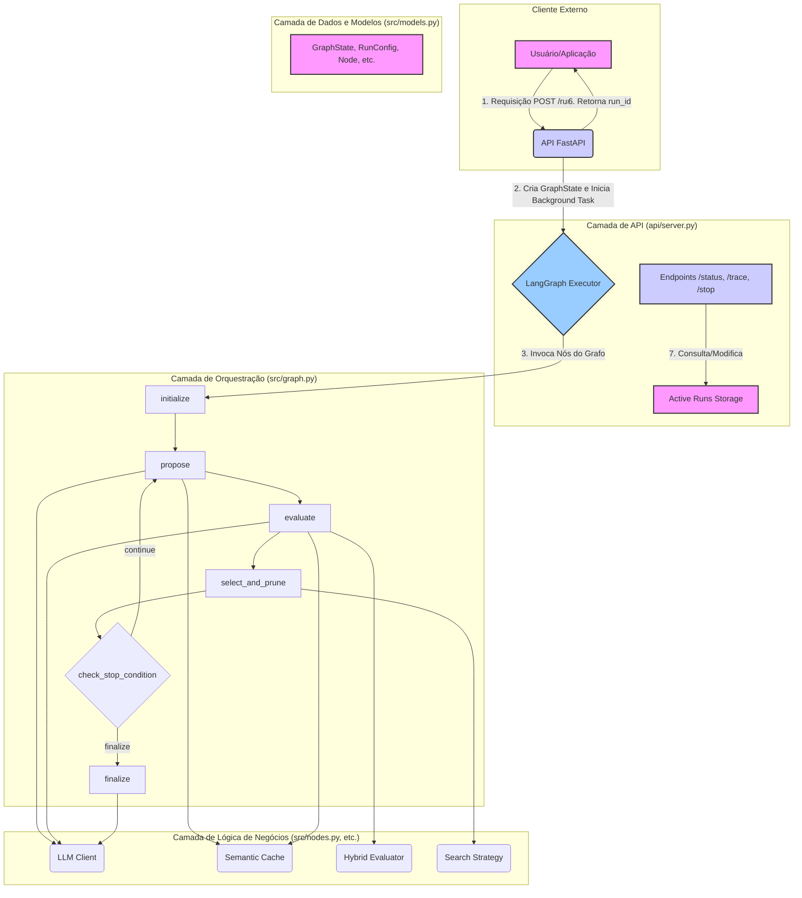

# Documento Conceitual e Arquitetônico do MCP TreeOfThoughts

## 1. Visão Conceitual

O **MCP TreeOfThoughts** é uma plataforma de raciocínio automatizado projetada para superar as limitações dos métodos de prompting tradicionais (como o *Chain of Thought*). Enquanto o *Chain of Thought* explora um único caminho de raciocínio, o Tree of Thoughts (ToT) [1] modela a resolução de problemas como uma exploração em uma árvore de pensamentos, permitindo que o Large Language Model (LLM) explore múltiplos caminhos de raciocínio em paralelo, avalie o progresso e faça escolhas estratégicas sobre qual caminho seguir.

Este projeto implementa o conceito de ToT como um **Model Context Protocol (MCP)**, uma arquitetura de software que orquestra a interação entre LLMs, dados e lógica de controle para resolver tarefas complexas.

### 1.1. Princípios Fundamentais

- **Decomposição do Pensamento**: Problemas complexos são decompostos em unidades de pensamento menores e gerenciáveis. Cada "pensamento" é um passo intermediário na resolução do problema.
- **Geração Deliberada**: Em vez de gerar uma única saída, o LLM é usado para propor múltiplos pensamentos ou próximos passos possíveis a partir de um estado de raciocínio atual.
- **Avaliação Explícita**: Cada pensamento gerado é avaliado por um "avaliador" (que pode ser o próprio LLM, uma heurística baseada em regras ou um modelo treinado) para determinar sua viabilidade e promessa em direção à solução final.
- **Busca Estratégica**: Uma estratégia de busca (como *Beam Search* ou *Best-First Search*) é usada para navegar pela árvore de pensamentos, decidindo quais ramos explorar a seguir e quais podar, otimizando o uso de recursos computacionais.

## 2. Arquitetura de Software

A arquitetura do MCP TreeOfThoughts é projetada para ser modular, extensível e robusta, utilizando uma pilha de tecnologias modernas de Python.

### 2.1. Pilha de Tecnologias (Stacks)

| Tecnologia | Propósito | Justificativa |
| :--- | :--- | :--- |
| **Python 3.9+** | Linguagem de programação principal | Ecossistema maduro para IA e desenvolvimento web, com vasto suporte de bibliotecas. |
| **FastAPI** | Framework da API | Oferece alta performance, validação de dados nativa com Pydantic e geração automática de documentação interativa (Swagger UI). Ideal para criar APIs RESTful robustas. |
| **LangChain / LangGraph** | Orquestração do fluxo de trabalho | `LangGraph` fornece uma maneira poderosa e explícita de definir a lógica de controle como um grafo de estados cíclico, o que é perfeito para a natureza iterativa do ToT. Facilita a depuração e a visualização do fluxo. |
| **Pydantic V2** | Modelagem e validação de dados | Garante a integridade dos dados em toda a aplicação, desde as requisições da API até os estados internos do grafo. Essencial para a robustez e para evitar erros de tipo. |
| **Google Generative AI (Gemini)** | Modelos de Linguagem (LLM) | Fornece acesso a modelos de última geração para as tarefas de geração e avaliação de pensamentos. A biblioteca `google-generativeai` é usada para a integração. |
| **FAISS (Facebook AI Similarity Search)** | Cache Semântico | Permite a busca de similaridade em alta velocidade em milhões de vetores. Usado para criar um cache semântico que encontra pensamentos ou avaliações semanticamente similares, evitando recálculos e economizando custos de API. |
| **NumPy** | Computação numérica | Dependência fundamental para o FAISS e para a manipulação de vetores de embedding. |
| **Uvicorn** | Servidor ASGI | Servidor de alta performance necessário para executar a aplicação FastAPI. |
| **Pytest** | Framework de testes | Padrão da indústria para testes em Python, permitindo a criação de testes unitários e de integração robustos. |

### 2.2. Diagrama da Arquitetura

O diagrama abaixo ilustra a interação entre os principais componentes do sistema:

### 2.3. Detalhamento dos Componentes

- **API (FastAPI)**: A porta de entrada do sistema. É responsável por receber as requisições, validá-las usando os modelos Pydantic, iniciar as execuções em background para não bloquear o cliente, e fornecer endpoints para monitoramento e controle.

- **LangGraph Executor**: O motor que executa o grafo de estados. Ele gerencia a transição entre os nós (`propose`, `evaluate`, etc.) com base nas arestas condicionais (como a saída de `check_stop_condition`).

- **Nós do Grafo (`src/nodes.py`)**: Cada função neste arquivo representa uma etapa de processamento. Eles são os blocos de construção da lógica do ToT e são projetados para serem stateless, operando apenas no `GraphState` que recebem.

- **LLM Client (`src/llm_client.py`)**: Abstrai a comunicação com a API do Google Gemini. Centraliza a configuração da API key e a instanciação dos modelos, permitindo que o resto do código simplesmente solicite um cliente LLM configurado (`get_chat_llm`) ou um modelo de embedding (`get_embeddings`).

- **Semantic Cache (`src/cache/semantic_cache.py`)**: Um componente crucial para a otimização. Ele armazena os *embeddings* de textos (como caminhos de pensamento) e seus resultados associados (pensamentos gerados, scores de avaliação). Antes de uma operação custosa (como uma chamada de LLM), o cache é consultado para ver se uma tarefa semanticamente idêntica já foi realizada.
    - **Tecnologia**: Utiliza `FAISS` com `IndexFlatIP` e vetores normalizados, o que torna a busca por produto interno (Inner Product) equivalente à busca por similaridade de cosseno, ideal para encontrar textos semanticamente próximos.

- **Search Strategies (`src/strategies/`)**: Implementa a lógica de busca na árvore. A arquitetura é plugável:
    - `base.py`: Define a interface abstrata `SearchStrategy`.
    - `beam_search.py`: Mantém um número fixo (`beam_width`) dos melhores caminhos a cada passo.
    - `best_first_search.py`: Uma estratégia mais "gananciosa" que sempre expande o nó mais promissor da fronteira.

- **Hybrid Evaluator (`src/evaluation/hybrid_evaluator.py`)**: Responsável por pontuar os pensamentos. Ele é "híbrido" porque primeiro aplica heurísticas baratas e rápidas e, somente se necessário, recorre a uma avaliação mais cara e nuançada por LLM.

## 3. Referências

[1] Yao, S., et al. (2023). *Tree of Thoughts: Deliberate Problem Solving with Large Language Models*. arXiv:2305.10601. Disponível em: https://arxiv.org/abs/2305.10601

